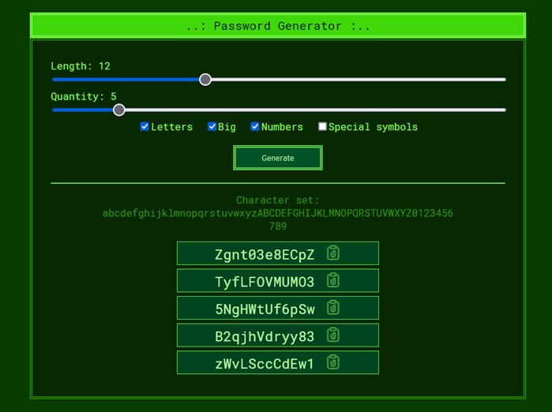

# Password Generator

## [Demo](https://devmikealex.github.io/password-generator/)

It's just a password generator written in TypeScript.

In the settings, you can choose the **length** of the password and the **character set** for generation. 

You can immediately generate several passwords and choose the one you like.
